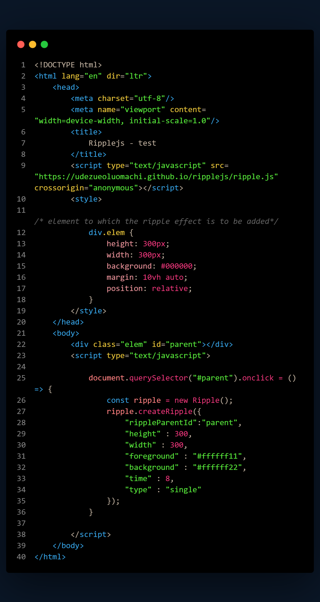
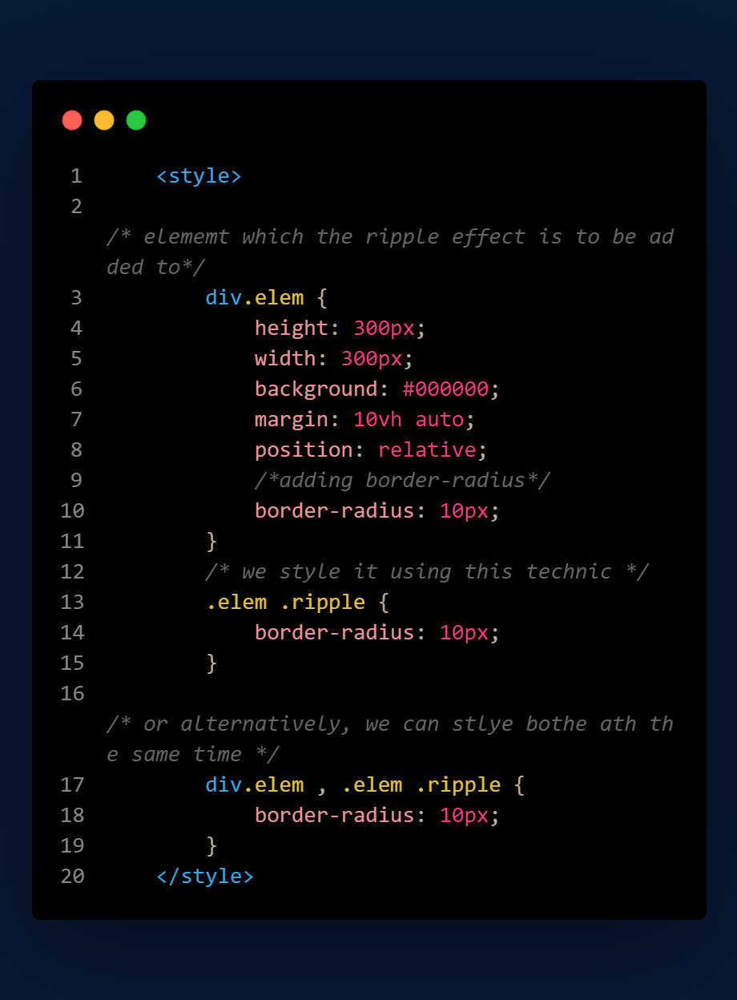

# About project
> **Ripplejs** is an _open source_ javascript library created for the purpose of adding _ripple effects_ to html elements based on mouse _events_.

# Live implementation
[View](https://udezueoluomachi.github.io/ripplejs/)

# How To use
Ripplejs is pretty easy to use just follow the steps below.

1. Link ripplejs to your project via this _****_ in the head section of your **HTML** document. Or you can simply **download** the **Ripplejs** source code from this repository and host it yourself or use it locally and of course, you have to add it in the _head section_ of your **HTML** document.

2. The ripple().createRipple object functions based on mouse events so you have to add a mouse **event listener** to the HTML element you want to add the ripple effect to.

# Example

# Code explanation

* const ripple = new Ripple(); //This creates a **new** ripple object
* ripple.createRipple() //The **createRipple** method houses the properties of the ripple effect and no property value must be ommited except for the **type property**

# Properties

* The **rippleParentId** property takes a value of type => _string_ which specifies the id of the element to which the ripple effect is to be added.

* The **height** , **width** and the **time** properties takes a value of type => _number_. The width and height properties specifies the height and width of the ripple effects in relation to that of the HTML element to which the ripple effect is to be added. While the time property specifies the time in milliseconds for which ripple effect would be **animated**.
  > Smaller times tend to provide better animations.

* The **background** and **foreground** properties takes a values of type => _string_ which can be color values of any format e.g HEX , RGB , HSL , etc.

  > The **background** property specifies the color of the background ripple when the **type** property value is not specified or is set to double. It specifies the color of the **ripple effect** when the **type** property has a value of _"single"_.
  > The **foreground** property specifies the color of the foremost ripple when the **type** property value is set to double or is not specified otherwise, it has no use. it can be ommited when the type is set to single.

* The **type** property takes a value of type => _string_ which specifies the type of the ripple effect to be created. Its **default** value is **double**.

  > To create a ripple effect that is made up of a **single** wave, the value of the **type** property has to be set to _"single"_ otherwise, a **double** ripple effect would be created.

# Errors and Debugging

* If you encounter any compatibility issues, add [Babel](https://google.com/search?how+to+add+javascript+babel+to+my+html+document+via+a+CDN+link) to your code because **ripplejs** is written based on [ES6](https://google.com/search?what+is+javascript+ES6) syntax.

* Do not omit any of the properties to be passed into the **createRipple()** method.

* You can only omit the values of properties which are optional.

# Properties with optional values

* The **type** property.

* The **foreground** property.

# Ommiting property values

* To omit the value of a property of type _string_ just leave the quote marks empty
  e.g {type : ""}

# Applying CSS

* The **ripple effect** is a member of your HTMl DOM tree for this fact, you can apply some css style to the **ripple effect element**.

* This feature was added to prevent the ripple from coming out of the edges of the elements to which the ripple effect is added.
  > A case is when you add **border radius** to the the element to which the ripple effect is added.

* The **ripple effect element** has a built-in class which is called **ripple**

* To style the ripple effect within a specific HTML element, you have to style it based on the syntax for styling  an element based on a parent-child relationship in the DOM tree.

## Example

> Lets say we want to style the ripple effect from the example above we do this

# Creator

**Udezue Oluomachi Chimaobi**
# Contact info

* [Github](https://www.github.com/udezueoluomachi)

* [Facebook](https://www.facebook.com/udezueoluomachi.chimaobi)

# Support project

* Follow me on [Github](https://www.github.com/udezueoluomachi).

* You can support this project by using it.

* By reporting bugs and giving suggestions on new features to add and how to improve it by creating issues on github about this repository.

* By contributing to it because it is open sourc.e

* You can also contact the creator via the links above if you want to provide funds.

* Do not forget to give this project a star if you like it.

**Thanks**